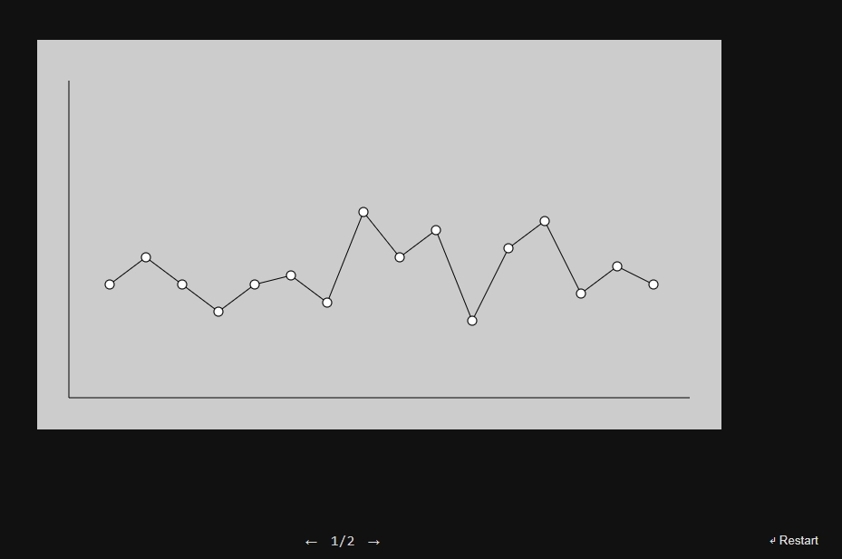

# canvas-graph
Автор: [Айнур Шауэрман](https://novosibirsk.hh.ru/resume/5f4f9b0fff07d6f7440039ed1f7476456e5a50)

Деплой: https://aykuli.github.io/canvas-graph/

[Вакансия](https://novosibirsk.hh.ru/vacancy/38548756?utm_source=email&utm_medium=email&utm_campaign=company_interested&utm_content=text&sent_date=2020_08_13)

Task

Необходимо реализовать анимированный линейный график на Canvas, не используя дополнительных библиотек.
График должен выполнять перестроение по клику на него. Количество точек — от 2 до 10, точки должны равномерно распределяться по оси X. Координата Y для точек должна быть произвольной и не выходить за границы визуальной области.

Скетч анимации по [ссылке](https://www.figma.com/proto/89wgPvgI4dxBHiwTpsbiux/JS-task?node-id=1%3A2&viewport=787%2C600%2C0.9435064792633057&scaling=min-zoom)

